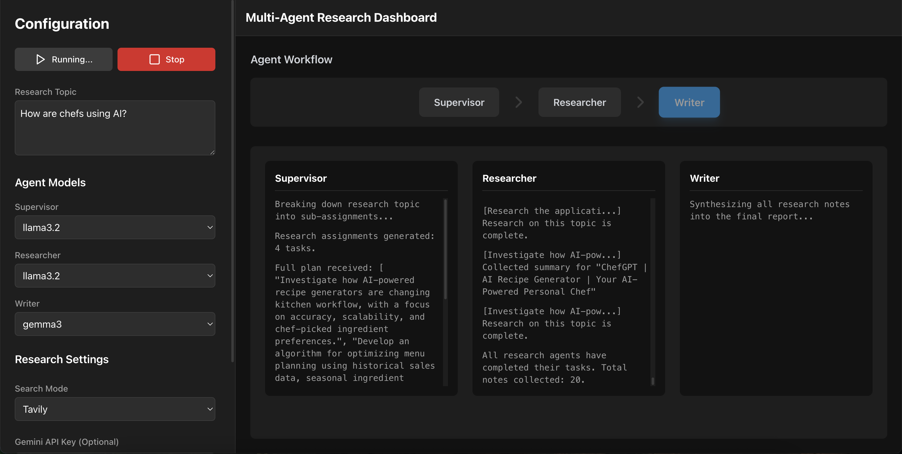

# Open Researcher

### Multi-Agent Research System

This project is a UI-driven, multi-agent research system designed to automate and streamline the research process. It leverages multiple AI agents, each with a specialized role (Supervisor, Researcher, Writer), to collaboratively define goals, gather information, and synthesize findings into a comprehensive, structured report.

The system is flexible, allowing users to run it entirely locally with [Ollama](https://ollama.com/), use a remote provider like Google's Gemini, or operate in a hybrid mode where different agents use different models.


### Features

*   **Multi-Agent Workflow**: Orchestrates a team of specialized AI agents for a structured research process.
*   **Flexible LLM Providers**:
    *   **Local**: Full support for local models via Ollama.
    *   **Remote**: Integration with the Gemini API.
    *   **Hybrid**: Mix and match providers for different agents (e.g., a powerful Gemini model for writing and a fast local model for research).
*   **Real-time Search Integration**: Uses the Tavily Search API for up-to-date information gathering. A mock search mode is also available for offline use or to run without an API key.
*   **Interactive Dashboard**: A user-friendly interface to configure settings, start/stop research, monitor agent progress in real-time, and view results.
*   **Exportable Results**: Download the final report as a Markdown file or get a complete JSON log of the entire research process, including all agent messages and search results.

### How It Works

The research process is broken down into three main phases, each handled by a specialized agent:

1.  **Supervisor**: Receives the main research topic from the user and breaks it down into a series of detailed, actionable sub-topics or research assignments.
2.  **Researcher(s)**: For each sub-topic, a researcher agent is dispatched. It formulates a search query, executes it using the configured search provider (Tavily or mock), and then uses its LLM to read and summarize the most relevant findings from the search results.
3.  **Writer**: Once all research is complete, the writer agent gathers all the summarized notes from the researchers. It then synthesizes this information into a single, cohesive, and well-structured report in Markdown format, complete with source citations.




### Future Enhancements
LLMs should interact with the research platform via tool calls instead of regex matching.

### Getting Started

#### Prerequisites

1.  **Node.js**: Make sure you have Node.js (v18 or later) installed.
2.  **Ollama (for local models)**: To use local models, you must have Ollama installed and running on your machine.

#### Installation & Setup

1.  **Download the project** and navigate into the project directory in your terminal.

2.  **Install dependencies:**
    ```bash
    npm install
    ```

3.  **Pull Ollama Models (Optional):**
    If you plan to use local models, pull them using the Ollama CLI. The app is pre-configured for these models, but you can use others from the Ollama library.
    ```bash
    ollama pull llama3.2
    ollama pull mistral
    ollama pull gemma3
    ```

4.  **Run the application:**
    ```bash
    npm run dev
    ```
    The application will be available at `http://localhost:5173` (or another port if 5173 is in use).

### How to Use the Application

All configuration is done directly within the application's UI in the **Control Panel** on the left.

1.  **Enter Research Topic**: Start by typing your research topic into the main input field (e.g., "The impact of AI on renewable energy management").

2.  **Configure API Keys (Optional)**:
    *   **Gemini API Key**: If you want to use a Gemini model for any agent, paste your API key into this field.
    *   **Tavily API Key**: To use real-time web search, paste your Tavily API key here. If you leave this blank, the system will use built-in mock search data, allowing you to run a full research cycle offline.

3.  **Configure Agents**:
    *   For each agent (`supervisor`, `researcher`, `writer`), use the dropdown menus to select a **Provider** (Ollama or Gemini) and a specific **Model**.
    *   To run entirely locally, ensure all agents are set to use the `ollama` provider.

4.  **Select Search Mode**:
    *   Choose `Tavily` for live web searches (requires a key) or `Mock` to use sample data without making external calls.

5.  **Start the Research**:
    *   Click the **"Start Research"** button.
    *   The dashboard will show which agent is active, and the **Log Viewer** will display real-time updates.

6.  **View and Export the Report**:
    *   Once the process is complete, the **Final Report** will be rendered in the main view.
    *   Use the export buttons to download the report as a `.md` file or the full process log as a `.json` file.


```mermaid
graph LR
    A[Start Research Process] --> B[Initialize];

    subgraph Supervisor Agent
        C[Break down Topic into Assignments]
        B --> C;
        C --> D{Parse JSON Response?};
        D -- Yes --> E[Research Topics Generated];
        D -- No --> F[Fallback: Extract Topics];
    end

    E --> G[Dispatch Researchers];
    F --> G;

    subgraph Researcher Agents Parallel
        G --> H[For Each Topic];
        H --> I{Execute Search Tavily/Mock};
        I -- Found Results --> J[Summarize Information];
        I -- No Results --> K[No Sources];
        J --> L[Collect Note];
        K --> L;
        L --> M[All Notes Collected];
    end

    M --> N[Writer Agent];
    N --> O[Synthesize Final Report];
    O --> P[Set Final Report];
    P --> Q[End Research Process];

    style A fill:#f9f,stroke:#333,stroke-width:2px;
    style Q fill:#f9f,stroke:#333,stroke-width:2px;
    style D fill:#ADD8E6,stroke:#333,stroke-width:2px;
    style I fill:#ADD8E6,stroke:#333,stroke-width:2px;
    style B fill:#e0e0e0,stroke:#333;
    style N fill:#e0e0e0,stroke:#333;
    ```